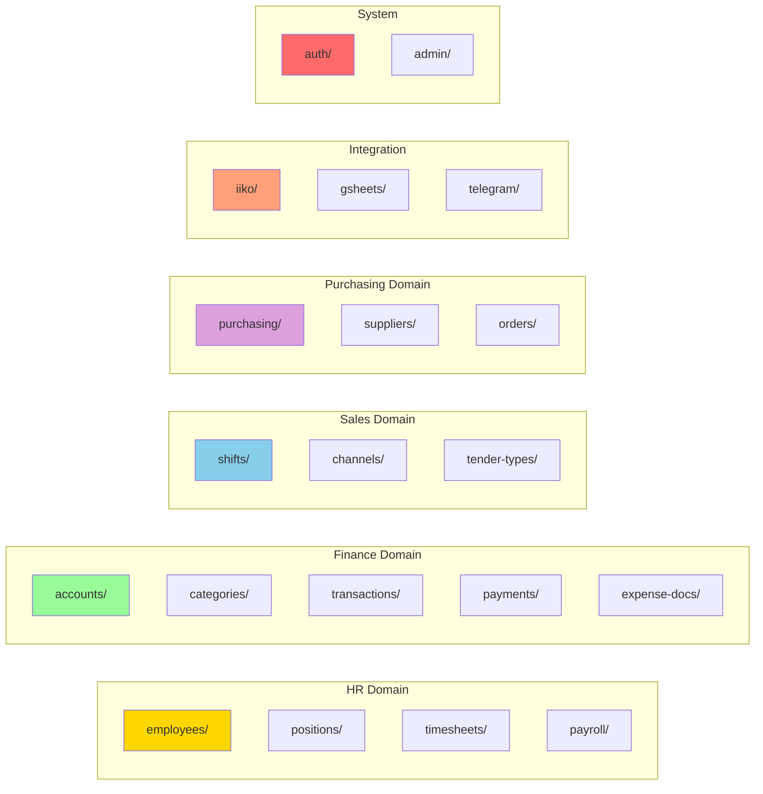
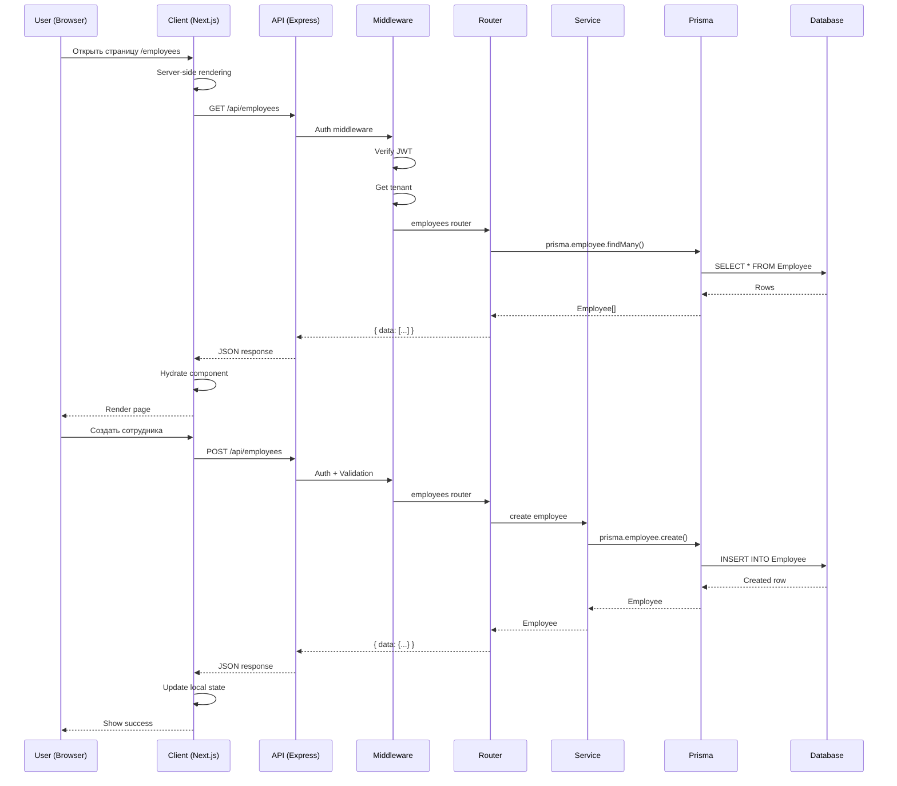
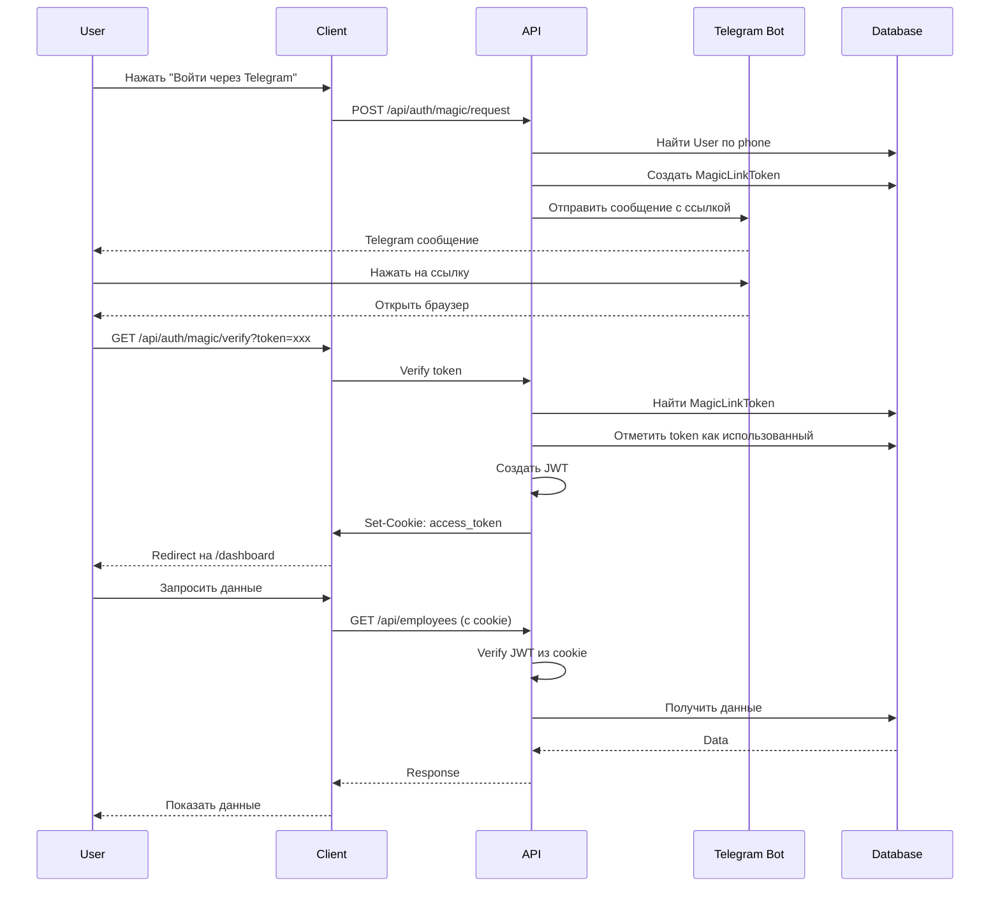
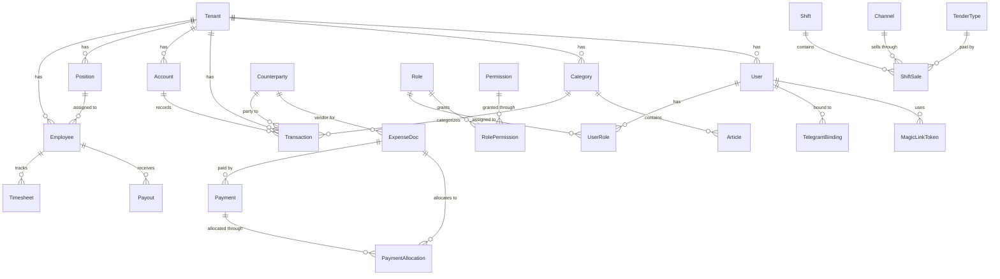
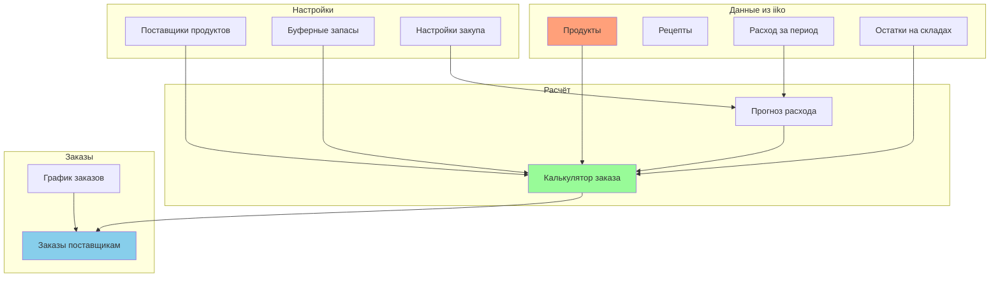
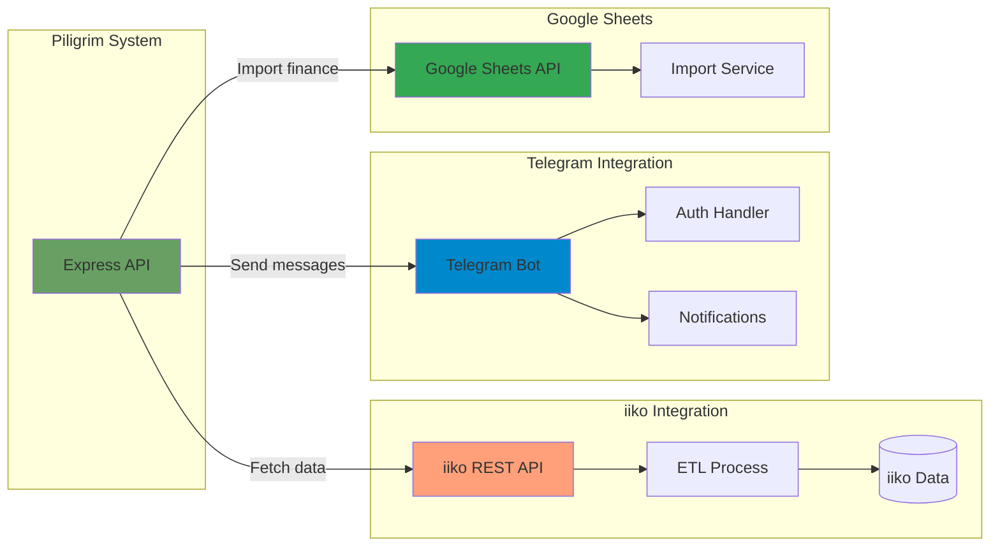

# 🏗️ Диаграммы архитектуры Piligrim

## 📐 Общая архитектура системы

```mermaid
graph TB
    subgraph "Client Layer"
        Browser[Веб-браузер]
        NextJS[Next.js 14 App]
        Components[React Components]
        Hooks[Custom Hooks]
    end
    
    subgraph "Network"
        Caddy[Caddy Reverse Proxy]
    end
    
    subgraph "Server Layer"
        Express[Express.js API]
        Middleware[Middleware Chain]
        Routers[Domain Routers]
        Services[Business Services]
    end
    
    subgraph "Data Layer"
        Prisma[Prisma ORM]
        SQLite[(SQLite DB)]
    end
    
    subgraph "External Services"
        Telegram[Telegram Bot API]
        iiko[iiko Restaurant API]
        GSheets[Google Sheets API]
    end
    
    Browser --> Caddy
    Caddy --> NextJS
    Caddy --> Express
    
    NextJS --> Components
    Components --> Hooks
    Hooks -->|REST API| Express
    
    Express --> Middleware
    Middleware --> Routers
    Routers --> Services
    Services --> Prisma
    Prisma --> SQLite
    
    Express -->|Auth| Telegram
    Express -->|Import Data| iiko
    Express -->|Import Finance| GSheets
    
    style Browser fill:#e1f5ff
    style NextJS fill:#61dafb
    style Express fill:#68a063
    style Prisma fill:#2d3748
    style SQLite fill:#003b57
```



## 🎯 Слоистая архитектура (Layered Architecture)

```mermaid
graph TD
    subgraph "Presentation Layer"
        UI[UI Components]
        Forms[Forms & Inputs]
        Tables[Data Tables]
        Charts[Charts & Graphs]
    end
    
    subgraph "Application Layer"
        API[REST API Endpoints]
        Auth[Authentication]
        Validation[Input Validation]
        BL[Business Logic]
    end
    
    subgraph "Data Access Layer"
        ORM[Prisma Client]
        Queries[Database Queries]
        Migrations[Schema Migrations]
    end
    
    subgraph "Database"
        DB[(SQLite)]
    end
    
    UI --> API
    Forms --> API
    Tables --> API
    Charts --> API
    
    API --> Auth
    API --> Validation
    API --> BL
    
    BL --> ORM
    ORM --> Queries
    Queries --> DB
    Migrations --> DB
    
    style UI fill:#61dafb
    style API fill:#68a063
    style ORM fill:#2d3748
    style DB fill:#003b57
```



## 🧩 Модульная структура Backend



## 🔄 Поток данных (Data Flow)



## 🔐 Авторизация (Authentication Flow)



## 💾 Модель данных (Entity Relationship)



## 🎨 Frontend структура (Feature-based)

```mermaid
graph TD
    subgraph "app/"
        Layout[layout.tsx]
        Dashboard[/(dashboard)/]
    end
    
    subgraph "Dashboard Features"
        Employees[employees/]
        Finance[finance/]
        Sales[sales/]
        iiko[iiko/]
        Admin[admin/]
    end
    
    subgraph "finance/"
        Accounts2[accounts/]
        Categories2[categories/]
        Payments2[payments/]
        Transactions2[transactions/]
        Reports[reports/]
    end
    
    subgraph "Shared"
        Components[components/ui/]
        Hooks2[hooks/]
        Lib[lib/]
    end
    
    Layout --> Dashboard
    Dashboard --> Employees
    Dashboard --> Finance
    Dashboard --> Sales
    Dashboard --> iiko
    Dashboard --> Admin
    
    Finance --> Accounts2
    Finance --> Categories2
    Finance --> Payments2
    Finance --> Transactions2
    Finance --> Reports
    
    Employees -.-> Components
    Finance -.-> Components
    Sales -.-> Components
    
    Employees -.-> Hooks2
    Finance -.-> Hooks2
    
    Hooks2 -.-> Lib
    
    style Layout fill:#61dafb
    style Components fill:#98fb98
    style Hooks2 fill:#ffd700
    style Lib fill:#dda0dd
```

## 🚀 Deployment Architecture

```mermaid
graph TB
    subgraph "Development"
        Dev[Developer]
        Git[Git Repository]
    end
    
    subgraph "CI/CD (будущее)"
        GHA[GitHub Actions]
        Tests[Run Tests]
        Build[Build Images]
    end
    
    subgraph "Production Server"
        Hook[post-receive hook]
        Docker[Docker Build]
        Compose[Docker Compose]
    end
    
    subgraph "Running Containers"
        Caddy2[Caddy Container]
        Web[Next.js Container]
        API[Express Container]
    end
    
    subgraph "Storage"
        DB2[(SQLite Volume)]
        Logs[Logs Volume]
    end
    
    Dev -->|git push prod| Git
    Git -->|trigger| Hook
    Hook --> Docker
    Docker --> Compose
    Compose --> Caddy2
    Compose --> Web
    Compose --> API
    
    API --> DB2
    Web --> Logs
    API --> Logs
    
    style Dev fill:#61dafb
    style Git fill:#f05032
    style Docker fill:#2496ed
    style Caddy2 fill:#1f88c0
    style Web fill:#000000
    style API fill:#68a063
```



## 🔄 Middleware Chain

```mermaid
graph LR
    Request[HTTP Request]
    
    subgraph "Global Middleware"
        CORS[CORS]
        JSON[body-parser]
        Cookie[cookie-parser]
        ALS[AsyncLocalStorage]
        Guard[Auth Guard]
    end
    
    subgraph "Route Middleware"
        Validate[validateYearMonth]
        Tenant[attachTenant]
        Async[asyncHandler]
    end
    
    Handler[Route Handler]
    Response[HTTP Response]
    
    Request --> CORS
    CORS --> JSON
    JSON --> Cookie
    Cookie --> ALS
    ALS --> Guard
    Guard --> Validate
    Validate --> Tenant
    Tenant --> Async
    Async --> Handler
    Handler --> Response
    
    style Request fill:#e1f5ff
    style Guard fill:#ff6b6b
    style Handler fill:#68a063
    style Response fill:#98fb98
```



## 📊 Система закупок (Purchasing System)



## 🔗 Интеграции (External Integrations)



---

## 📝 Легенда

### Цвета компонентов:
- 🔵 **Синий (#61dafb)** — React/Next.js компоненты
- 🟢 **Зелёный (#68a063)** — Backend/Express.js
- ⚫ **Тёмный (#2d3748)** — ORM/Prisma
- 🔷 **Тёмно-синий (#003b57)** — База данных
- 🔴 **Красный (#ff6b6b)** — Безопасность/Auth
- 🟡 **Жёлтый (#ffd700)** — HR модули
- 🟣 **Фиолетовый (#dda0dd)** — Закупки
- 🟠 **Оранжевый (#ffa07a)** — Внешние интеграции

### Типы связей:
- **→** Прямой вызов/зависимость
- **⇢** Асинхронная связь
- **--** Данные
- **-.** Переиспользование

---

*Диаграммы созданы с использованием Mermaid.js*  
*Последнее обновление: 9 октября 2025*

